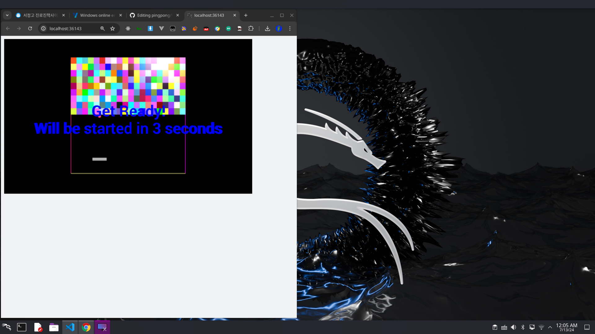

# pongpong

execute pong.py
other file is nothing

"""
nuitka pong.py
"""

선생님을 위한 프로그램 실행 방법
웹에서 실행할 수 없는 외부 및 파이썬 내부 라이브러리 몇가지가 더 있어요!
그래서 requirements.txt 에 있는 라이브러리들을 다운받아주시고
pong.py를 실행해주시면 사진처럼 실행이 될 겁니다!

